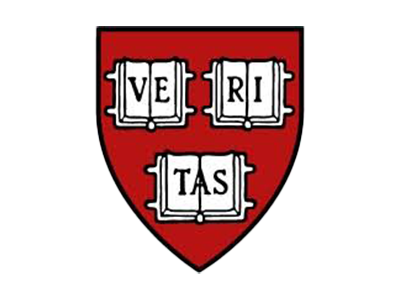

<h1 align="center">Hi 👋, I'm Kevan</h1>
<h3 align="center">A fledgling web developer/student from Canada</h3>

  

- 🔭 I’m currently working on [The Odin Project](https://www.theodinproject.com/paths/full-stack-javascript)

- 🌱 I’m currently learning **JavaScript, React, Node, Express, Mongo, TypeScript, AWS**

- 📫 How to reach me - **<a href="mailto:kevan.haggins@gmail.com">Email</a>** || **<a href="https://www.linkedin.com/in/kevan-haggins/">LinkedIn</a>**

<h3 align="left">Course Work + School Projects:</h3>

